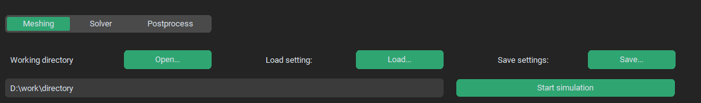

.. _bottomstatic:

Bottom Static Menu
==================
Bottom static menu provides selection of starting simulation stage, writing and reading of overall simulation settings and working directory.

Meshing/Solver/Postprocess
^^^^^^^^^^^^^^^^^^^^^^^^^^
- **type**: segment - string

Option to start simulation from certain stage. User can choose to start from either meshing, solver or postprocessing stage.

Working directory
^^^^^^^^^^^^^^^^^
- **type**: text win. - string

Path to a working directory where all the outputs and results will be saved

Load settings
^^^^^^^^^^^^^
- **type**: button - string

Opens an explorel window where simulation settings .json file can be chosen.

Save settings
^^^^^^^^^^^^^
- **type**: button - string

Write .json file containing simulation settings.

Start calculation
^^^^^^^^^^^^^^^^^
- **type**: button - sim_class

Pushes the simulation with current settings into a queue.
