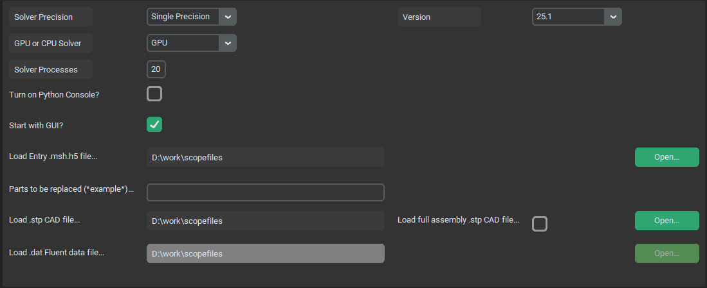

.. _general:

General Options Menu
====================
Geeneral options menu manages system settings such as bumber of preocesses for fluent, paths to input files, Fluent versions,
GPU selections and other misculaneous settings. This page should contain all relevant options from Fluent launcher window.

Solver Precision
^^^^^^^^^^^^^^^^
- **type**: switch - string

This variable is identical to a *Double Precision* check button in Fluent launcher and makes it possible to switch between
single and double precision solver. Single precision takes up roughly half RAM as double precision solver, but makes larger
rounding mistakes. Single precision is recomended (especially while using GPU) but users are encuraged to try the difference 
on their specific cases.

GPU or CPU Solver
^^^^^^^^^^^^^^^^^
- **type**: switch - string

This variable is identical to a *Native GPU Solver* check button in Fluent launcher. It gives user an option to solve the case
using GPU solver. This dramaticaly accelerates the solution, but high end computational GPU is recomended, as the whole case need 
to fit on GPU RAM (Nvidia A6000 i an example of good GPU for such aplication). With GPU Solver it is still needed to set up
proper processes count, as CPU is still used for meshing, loading and saving and postprocessing.

Solver Processes
^^^^^^^^^^^^^^^^
- **type**: text win. - integer

Specifies number of cores (threads) used by single fluent instance. 

Turn on Python console?
^^^^^^^^^^^^^^^^^^^^^^^
- **type**: check - bool

Wether to start fluent with python console (True) or classical Fluent TUI console (False).

Start with GUI?
^^^^^^^^^^^^^^^
- **type**: check - bool

Wether to start Fluent instance on background (False) or with Graphical User Interface (True).

Version
^^^^^^^
- **type**: Switch - string

Which Fluent version to start.

Load Entry .msh file...
^^^^^^^^^^^^^^^^^^^^^^^
- **type**: text win. - string

String path to a Entry mesh file that contains loaded geometry of a car. This is so that the entire car geomatry doesnt need to 
be imported every time only single part or subassembly is changed. This cam be also thought of as current development 
version of geometry.

Parts to be replaced (\*example*\ )...
^^^^^^^^^^^^^^^^^^^^^^^^^^^^^^^^^^^^^^
- **type**: text win. - string

Name of the part or subassembly that needs to be replaced from Entry mesh. For example, if we want to simulate new geometry of
front wing subassembly  which is named as **FW** in CAD tree, it needs to be specified between asterisks  **(\ *\ )**  as \*FW*\ .

Load .stp CAD file...
^^^^^^^^^^^^^^^^^^^^^
- **type**: text win. - string

Path to a .stp file that contains either a single part or subassembly or entire CAD model, depending on status of 
*load full assembly .stp CAD file...* check.

Load .msh Fluent mesh file...
^^^^^^^^^^^^^^^^^^^^^^^^^^^^^
- **type**: text win. - string

Replaces the *Load .stp CAD file...* nad takes path of a input volumetric mesh file for starting from solver.
(in case we already have mesh completed and want to start from solver stage, for example with different settings)

Load .dat Fluent data file...
^^^^^^^^^^^^^^^^^^^^^^^^^^^^^
- **type**: text win. - string

Path to a Fluent data file. This option is enabled only when starting from postprocessing stage (for more detailed postpro or
diferently placed cuts)

Load full assembly .stp CAD file...
^^^^^^^^^^^^^^^^^^^^^^^^^^^^^^^^^^^
- **type**: check - bool

Wheter to load a single new part or assembly or entire CAD model together with bodies of influence.