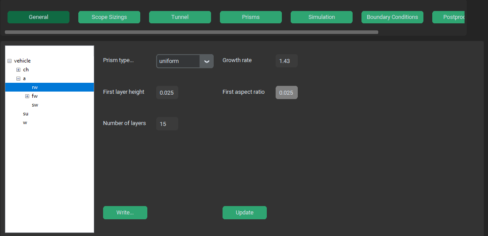

.. _prisms:

Prisms Options Menu
===================

Prisms options menu specifies inflation layers (a.k.a. prisms) on specified parts and assemblies. This menu scopies the scoped sizing menu in 
terms of aviable mesh sizings.

Prism type
^^^^^^^^^^
- **type**: switch - string

What type of inflation lasyer is to be applied to a given surface. Aviable are *uniform*, *aspect ratio* and *last ratio*.
for more info on prism types see `Adding Boundary Layers <https://ansyshelp.ansys.com/account/secured?returnurl=/Views/Secured/corp/v252/en/flu_ug/tgd_user_workflow_guided_tasks_ftm_add_boundary_layer.html>`_.

Growth rate
^^^^^^^^^^^
- **type**: text win. - float

A rate of geometric growth of neighboring layers.

First layer height
^^^^^^^^^^^^^^^^^^
- **type**: text win. - float

Active when *uniform* Prism type is selected. A hight of first prism layer in mm.

First aspect ratio
^^^^^^^^^^^^^^^^^^
- **type**: text win. - float

Active when *aspect ratio* Prism type is selected. A ratio between surface cell size and first layer height.

First aspect ratio
^^^^^^^^^^^^^^^^^^
- **type**: text win. - float

Active when *last ratio* Prism type is selected. A ratio between surface cell size and last layer height.

Number of layers
^^^^^^^^^^^^^^^^
- **type**: text win. - integer

Total number of prism layers.

Write...
^^^^^^^^
- **type**: button - string

Opens an explorer window through which user saves the current prism and scoped sizing settings into a .json file.

Update
^^^^^^
- **type**: button - -

Saves changed parameters for current prism sizing. Needs to be pressed after every change to a prisms.
