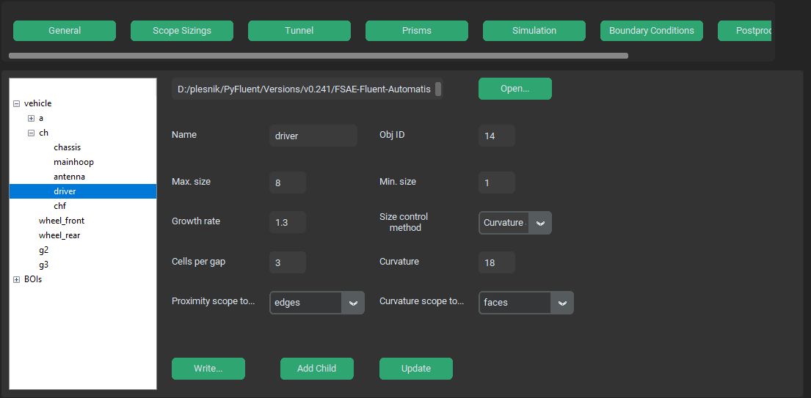

.. _scopesizing:

Scoped Sizing Options Menu
==========================
Scoped Sizing options menu specifies mesh dimensions on specified parts and assemblies and also in Bodies Of Influence (BOI).

Open...
^^^^^^^
- **type**: text win. - string

Path to a .json file containing scoped sizings to be loaded. Opens an explorer window

Name
^^^^
- **type**: text win. - string

Name of mesh sizing. Should match name of coinciding part or assembly in CAD tree.

Obj ID
^^^^^^
- **type**: text win. - integer

ID of created mesh sizing. Creates automatically, no need to overwrite.

Max. size
^^^^^^^^^
- **type**: text win. - float

Maximum allowed mesh size (in mm) at given location.

Min. size
^^^^^^^^^
- **type**: text win. - float

Minimum allowed mesh size (in mm) at given location. If another sizing with smaller Min. size value exist on same part, smaller value is used.

Growth rate
^^^^^^^^^^^
- **type**: text win. - float

A maximum rate of geometric growth of neighboring cells.

Size control method 
^^^^^^^^^^^^^^^^^^^
- **type**: switch - string

Which size controls are to be applied for given assembly. Aviable are *Curvature*, *Proximity* and *Curvature and Proximity*.
For more info see `Size Functions and Scoped Sizing <https://ansyshelp.ansys.com/account/secured?returnurl=/Views/Secured/corp/v252/en/flu_ug/tgd_user_size_functions.html>`_

Cells per gap
^^^^^^^^^^^^^
- **type**: text win. - float

Active when proximity method is selected. Minimum cell layers used to fill a gap.

Curvature
^^^^^^^^^
- **type**: text win. - float

Active when curvature method is selected. Minimum angle to be preserved in curve.

Proximity scope to...
^^^^^^^^^^^^^^^^^^^^^
- **type**: switch - string

Active when proximity method is selected. Defines to which part geomatry feature the proximity sizing is applied to. Aviable are *Edge*, *Faces*
and *Faces and Edges*.

Curvature scope to...
^^^^^^^^^^^^^^^^^^^^^
- **type**: switch - string

Active when curvature method is selected. Defines to which part geomatry feature the curvature sizing is applied to. Aviable are *Edge*, *Faces*
and *Faces and Edges*.

Write...
^^^^^^^^
- **type**: button - string

Opens an explorer window through which user saves the current prism and scoped sizing settings into a .json file.

Add Child
^^^^^^^^^
- **type**: button - mesh_object

Adds a new mesh sizing under a currently chosen sizing. 

Update
^^^^^^
- **type**: button - -

Saves changed parameters for current mesh sizing. Needs to be pressed after every change to a sizing.

