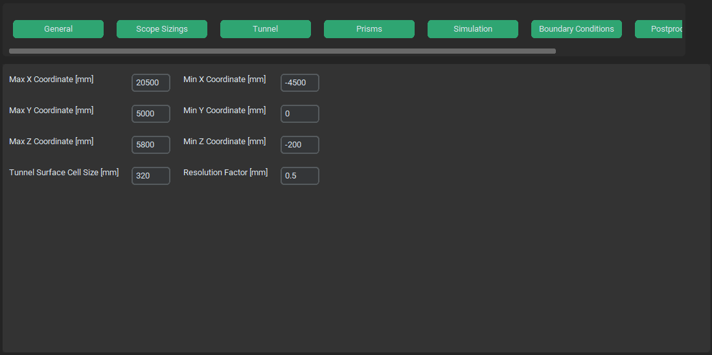

.. _tunnel:

Tunnel Options Menu
===================
Tunnel options menu specifies dimensions of external computational domain (tunnel), tunnel surface mesh size and wrap resolution.

Max/Min X Coordinate [mm]
^^^^^^^^^^^^^^^^^^^^^^^^^
- **type**: text win. - integer

Maximum and minimum X coordinate ox tunnel in mm.

Max/Min Y Coordinate [mm]
^^^^^^^^^^^^^^^^^^^^^^^^^
- **type**: text win. - integer

Maximum and minimum Y coordinate ox tunnel in mm.

Max/Min Z Coordinate [mm]
^^^^^^^^^^^^^^^^^^^^^^^^^
- **type**: text win. - integer

Maximum and minimum Z coordinate ox tunnel in mm.

Tunnel Surface Cell Size [mm]
^^^^^^^^^^^^^^^^^^^^^^^^^^^^^
- **type**: text win. - integer

Maximum surface cell size on surface of tunnel.

Resolution Factor
^^^^^^^^^^^^^^^^^
- **type**: text win. - float

Setting a value less than 1 can help to find holes not aligned to the Cartesian axes by using finer sampling than the given size field.
In situations where a hole's minimum size is larger than the size field's minimum size, using a Resolution Factor helps to find holes
without modifying the size field. That is, you can use the same size field for both hole fixing and wrapping.
For more info see `Wrapping Objects <https://ansyshelp.ansys.com/account/secured?returnurl=/Views/Secured/corp/v251/en/flu_ug/tgd_user_wrapper.html?q=Resolution%20factor>`_