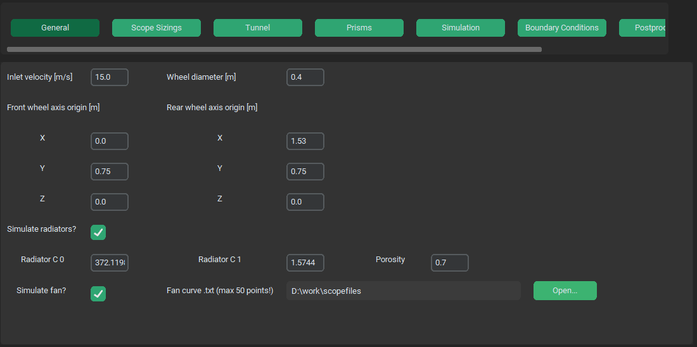

.. _boundary_conditions_guide:

Boundary Conditions Options Menu
================================
Boundary conditions options menu specifies inlet velocity, wheel diameter and wheel base, radiators and fan settings.

Inlet velocity [m/s]
^^^^^^^^^^^^^^^^^^^^
- **type**: text win. - float

Inlet air velocity. Same as car speed.

Wheel diameter [m]
^^^^^^^^^^^^^^^^^^