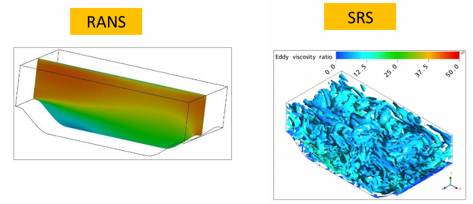
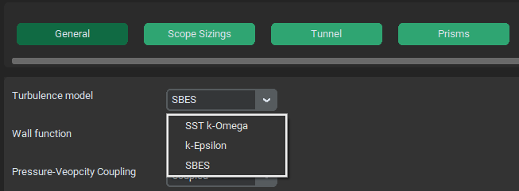
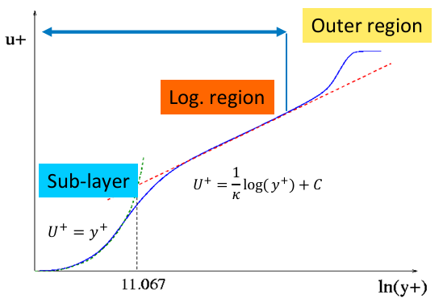
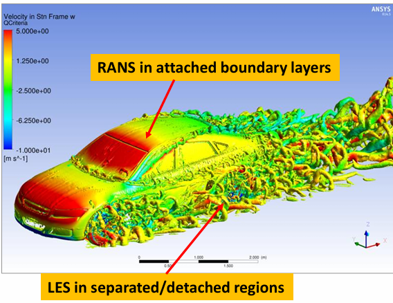

.. _solver_setup:

Setting up solver
=================
AutoFluent offers some solver settings choices mainly concerned with Turbulence settings, Pressure-Velocity coupling and Transient or Steady state settings.

Turbulence
^^^^^^^^^^
Turbulence is usualy characterised as chaotic behavior of fluid motion. This chaotic behavior is present across all length scales of fluid motion, ranging from unpredictibility 
of atmospheric motions all the way down up to mollecular motion. Thanksfully not all scales are of the same interest and smaller scales, which would otherwise be 
incredibly expensive to compute directly, can be summarized as a propperty of fluid. This is what turbulence models do, they 'model' the smaller scales of turbulence, instead 
of computing them directly and in doing so allowing us reduce the ammount of computational cells to simulate only the relevant flow scales.

There are two general trubulence modeling aproaches. Reynolds Averaged Navier Stokes (RANS) and  Scale-Resolving Simulations (SRS).The RANS models are an industry standard 
for large and complex models, as they are the crudest simplification of turbulence. RANS models tread velocity fluctuations as single time averaged value that affects the fluid 
flow in simmilar way as mollecular viscosity and is then treated the same way. The SRS models directly simulate larger eddies and smaller scales are modelled. This provides much 
better description of overall flow but mesh resolution requirements are way much larger.

Curently there are 3 turbulence models aviable in AutoFluent, k-Epsilon (RANS), SST k-Omega (RANS) and k-Omega SBES (Hybrid).

k-Epsilon
"""""""""
k-Epsilon is a widely used two-equation RANS model. Curently, at least for external aerodynamics, its use is rather a matter of model comparison or very coarse meshes.
This model depends on so called wall functions to properly model boundary layers. This means that not so many cells are needed to model the boundary layer, but this 
model also notoroiusly underpredicts boundary layer separation. Its use is then recommended only if computational power needed to fully resolve the boundary layer is 
not aviable.

The reccomended y+ value for this model is 30 \ <\  y+ \ <\  150.

Curently there are aviable these wall functions:

* Enhanced
* Standard
* Non-equilibrium

.. image:: ../_static/user_guide/k-Epsilon.png
  :width: 500

SST k-Omega
"""""""""""

SST k-Omega is a extremely popular model which coombines strength of k-Epsilon in free sheer flows and good predictions of k-Omega in boundary flows. This model is 
able to reasonably well predict flow separation, which is especially important when simulating wing profiles and their angle of attack. 
It is reccomended to use this model, as it is in theory able to simulate boundary layer well regardless of prism layer height.

Nevertheless some rules should be adhered to:

* Parts of aerodynamic interest should be meshed with values of y+  \ <\  5
* No parts should be in range 5 \ <\  y+ \ <\  30.
* Not so important parts should be meshed with values 30 \ <\  y+ \ <\  150

SBES
""""

Stress-Blended Eddy Simulation (SBES) is a hybrid RANS-LES turbulence model that adds the ability to switch (blend) from the underlying RANS model directly
to any existing algebraic LES model. In places where flow requires it and mesh size allows it this model cumputes as scale resolving LES model and in places with coarser 
mesh it switches into k-Omega model. This allows us to detailly study specific parts by refining mesh in their surroundings while keeping the rest of the model managable.

This model is aviable only with transient simulation setting. It is then reccomended only when very powerfull cumpute servers or rather even GPUs are aviable.

Pressure-Velocity Coupling
^^^^^^^^^^^^^^^^^^^^^^^^^^
The pressure-velocity coupling scheme controls the manner in which pressure and velocity are updated when the pressure-based solver is used. The scheme can be either segregated 
(pressure and velocity are updated sequentially) or coupled (pressure and velocity are updated simultaneously).In general, segregated methods are faster per iteration, 
while the coupled algorithm usually requires fewer iterations to converge. For this reason, the coupled solver is usually recommended for steady-state simulations. 
For transient simulations, the coupled solver has the best robustness properties, especially for large time step sizes, but SIMPLE may give faster overall solution times 
for small time step sizes.

Coupled solver is also almost twice as RAM memory consuming as SIMPLE solver, which can be used when not enough RAM memory is aviable.

Temporal settings
^^^^^^^^^^^^^^^^^
The decision between steady state solver and transient solver is a question of necessity. There are some phenomena that are not possible to simulate in steady-state solver
since these phenomena are transient in their nature. Solving full transient simulation for entire car is very computationaly expensive. The user then have to answer wheter 
it is necessary to simulate these phenomena or if time averaged values (which might not be correct) are enough for determining the general design direction.

Steady-state solver
"""""""""""""""""""
Steady state solver is a default tmporal settings. Fluent uses a pseudo-transient formulation which solves the case transiently increasing the time step according to the 
flow field behavior. User can scale this time step increase with **Pseudo-time step** option which in some cases can speed up convergence. Other aviable option is 
**Number of iterations** which should be set up so there is enough iterations for tha case to converge plus additional iterations so for iteration sampling of results.
This number will vary based on mesh size, mesh quality, and used settings.

Transient solver
""""""""""""""""
There are many transient phenomena that might interest an aerodynamic engineer, some of which are:

* vortex shedding
* vortex travel
* time variable separation
* flutter

If some of theese are of interest or if we are trying to understand periodic behaviors in our steady-state simulations. Transient solvers should be used.
**Time step size** should be determined such that the simulation is numericaly stable (Courant number) and that the periodic phenomena are properly resolved (Strouhal number).
In addition to time step size user have to also select **Iterations per time step**, which should be enough so the residuals at least resemble starting to converge, and 
**End time of simulation**, which should be long enough so that averaged values seems to be unchanging. 

Temperature and Altitude
^^^^^^^^^^^^^^^^^^^^^^^^
There si also options to set temperature and altitude of surroundings. These values are used for calculations of density and viscosity of air. 
The International Standard Atmosphere (ISA) model is used for these caculations.
These variables migh be usefull to compare tracks at differente climates and altitudes or to set these values to be the same as during real life measurement.